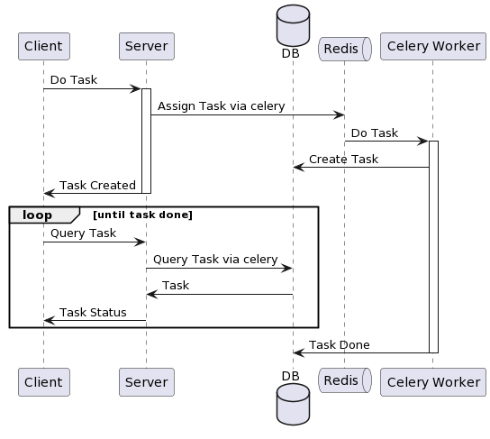
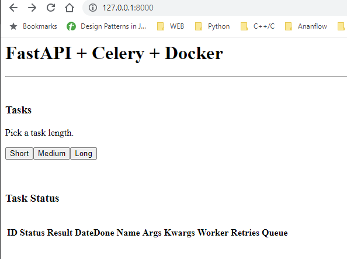

# FastAPI + Celery + Redis/PostgresSQL + Flower Example

An example microservices illustrates how to perform heavy background computation task such as running machine learning model, using tech stack:

- FastAPI
- Celery
- Redis: as broker
- PostgresSQL: lower backend
- SQLAlchemy: higher backend



NOTE:

- FastAPI will not involve with `Redis` and `PostgresSQL` directly, it's done through `Celery`
- Celery will manage backend `PostgresSQL` database via `SQLAlchemy`
- Celery will manage broker `Redis`
- Celery will detect schema [Task and TaskSet](https://docs.celeryq.dev/en/latest/internals/reference/celery.backends.database.models.html#celery.backends.database.models) in PostgreSQL and generate lazily when doing on the first job run.

## Get Started

```sh
docker-compose build
# CTRL+C: just stop containers while keeping data
docker-compose up
docker-compose up -d

# Remove containers with wiping data
docker-compose down 
```


